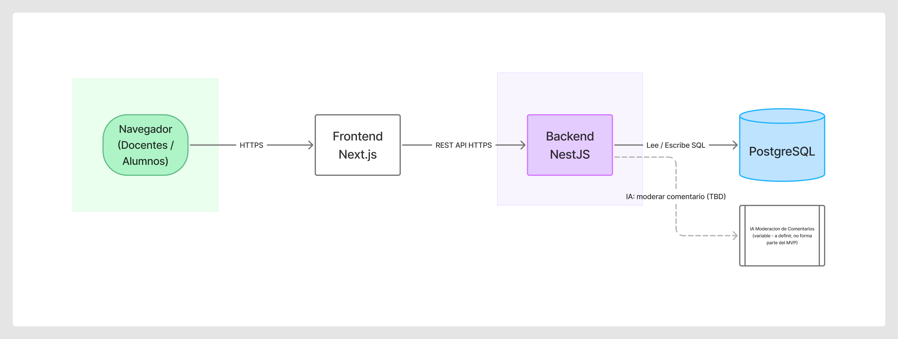

# Definición de Arquitectura

Estado: Aprobado

  
Fecha: 2026-09-27

## 1. Diagrama Cloud Detallado

Diagrama editable en FigJam: [https://www.figma.com/board/plHl5Sj8IOFzbWvf3vIq2P](https://www.figma.com/board/plHl5Sj8IOFzbWvf3vIq2P)

| Componente                      | Proveedor   | Rol                                                  |
| ------------------------------- | ----------- | ---------------------------------------------------- |
| Frontend Next.js                | Vercel      | Aloja y sirve la aplicación web (Edge Network)       |
| Backend NestJS                  | Render      | Web Service Node.js, proceso persistente             |
| PostgreSQL                      | Neon        | Base de datos administrada, capa gratuita permanente |
| IA de Moderación de Comentarios | *A definir* | **Variable pendiente** — ver sección 4               |

## 2. Setup de Infraestructura

### 2.1. Flujo de despliegue

1. Un commit se integra en `main`.
2. Vercel detecta el push y compila el workspace `front/`.
3. Render detecta el push, compila y levanta el workspace `back/`, escuchando en el puerto
 asignado por la variable `PORT`.
4. El backend se conecta a Neon mediante `DATABASE_URL` (con `sslmode=require`).
5. El frontend consulta al backend mediante `NEXT_PUBLIC_API_URL`; `GET /health` confirma que
 ambos servicios están arriba y comunicados.

### 2.2. Variables de entorno

| Servicio       | Variable              | Propósito                                     |
| -------------- | --------------------- | --------------------------------------------- |
| Render (Back)  | `DATABASE_URL`        | Cadena de conexión segura hacia Neon          |
| Render (Back)  | `PORT`                | Puerto asignado por Render para escuchar HTTP |
| Vercel (Front) | `NEXT_PUBLIC_API_URL` | URL pública del backend en Render             |

### 2.3. Decisiones clave

- **Render y no Vercel para el backend:** NestJS corre como proceso persistente
(`app.listen(port)`); forzarlo a Serverless en Vercel requiere adaptadores, limita el tiempo de
ejecución y complica el pool de conexiones a PostgreSQL.
- **Neon y no la base de Render:** el plan gratuito de Render expira las bases de datos a los 30
días; Neon ofrece nivel gratuito permanente compatible con Prisma.
- **Sin Docker en producción en esta fase:** alojar contenedores propios (EC2, Droplets, clusters)
excede el presupuesto gratuito del proyecto académico.

## 3. Repositorio Inicial con Actividad

- Repositorio: [github.com/Tiaguito-dev/2026-UTN-GRUPO-01](https://github.com/Tiaguito-dev/2026-UTN-GRUPO-01)
- Rama de integración: `desarrollo` · Rama estable: `main` (ver
[git-workflow.md](../standards/git-workflow.md))
- Primer commit: 2026-09-14 · Estado a la fecha de este documento: 14 commits, 4 pull requests
mergeados (#1 a #9), 4 colaboradores activos
- Estructura: npm workspaces (`front/`, `back/`), Docker Compose para PostgreSQL local, Node.js
22.22.3 + TypeScript, NestJS + Next.js + Prisma (ver
[TASK-001](../tasks/finished/TASK-001-formalizar-stack-inicial.md))

## 4. Variable Pendiente: IA de Moderación de Comentarios

**No forma parte del MVP actual.** El proveedor/modelo de IA para moderar comentarios (y
opcionalmente sugerir mejoras de redacción) todavía está en investigación — tarea que fusiona lo
que era el Spike 6 (ahora archivado). En el diagrama de la sección 1 aparece como nodo externo
conectado con línea punteada al backend, señalando que es una integración futura y no un
componente activo de la arquitectura actual.

Alcance de la investigación pendiente:

- Definir si el objetivo es solo moderación (bloquear/filtrar) o también sugerencia activa de
mejora de redacción.
- Comparar opciones (OpenAI, modelos open source, DeepSeek, Gemini para estudiantes, Amazon
Textract u equivalente para análisis de sentimiento/tono) por costo, latencia, precisión en
español, facilidad de integración y privacidad de datos (¿pueden enviarse comentarios de
alumnos a un servicio externo?).
- Definir reglas de negocio de bloqueo (insultos, datos personales, discurso de odio, spam) vs.
sugerencia (tono, claridad).
- Prototipo mínimo contra 10-15 comentarios de ejemplo, comparando 1-2 opciones candidatas.
- Definir el flujo de un comentario rechazado (aviso al usuario, posibilidad de reeditar).

Entregable esperado de esa investigación: documento de comparativa, POC con resultados, decisión
final y criterios de moderación definidos. Hasta que esa decisión exista, este documento no fija
proveedor ni costo asociado a esa pieza.